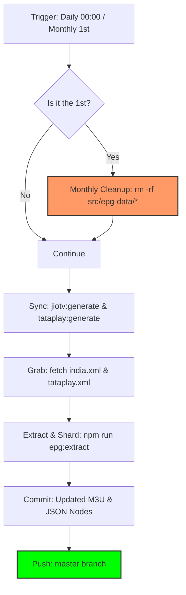
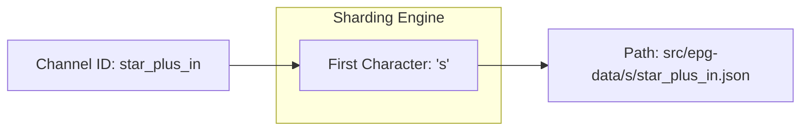

# 🤖 Automated EPG Setup & Sharding

This repository is now equipped with a fully automated CI/CD pipeline for generating and updating EPG data daily. It also uses a **Sharded JSON Architecture** to ensure high performance and bypass GitHub's file display limits.

## 🚀 GitHub Actions Automation

We have implemented a GitHub Action workflow that handles the entire EPG lifecycle automatically.

## ⚙️ CI/CD Pipeline Architecture

The following diagram illustrates the daily automated lifecycle, including the **Monthly Fresh Reset** logic.



## 📂 Sharding & Hashing Logic

To ensure **O(1) lookup performance** and bypass GitHub's 1,000-file directory limit, we use a deterministic sharding strategy.



### What it does:
1. **Daily Trigger**: Runs every day at `00:00 UTC`.
2. **Channel Alignment**: Executes `jiotv:generate` and `tataplay:generate` to keep channel lists and M3U files perfectly synced with the provider's official IDs.
3. **Multi-Source Grabbing**: Executes `npm run grab` for both JioTV (`india.channels.xml`) and Tata Play (`tataplay.channels.xml`).
4. **Smart Extraction**: Runs `npm run epg:extract` to consolidate and convert both XML sources into channel-specific JSON files.
5. **Sharded Distribution**: Automatically organizes files into subdirectories (e.g., `a/`, `b/`, `s/`) to stay under GitHub's 1,000-file per directory limit.
6. **Auto-Commit**: Pushes updated `.m3u`, `.channels.xml`, and the sharded `.json` data directly to your `master` branch.
7. **Monthly Fresh Reset**: On the 1st of every month, the pipeline automatically clears the `src/epg-data` folder before regeneration. This prevents your Git history from bloating with old, unused data over time.

### How to trigger manually:
1. Navigate to the **Actions** tab in this repository.
2. Select the **"Auto Update EPG"** workflow.
3. Click the **"Run workflow"** button.

---

## 📂 Sharded JSON Architecture

To support over 1,200 channels without hitting GitHub's web interface limits or slowing down your application, we use a sharded directory structure.

### Structure:
```text
src/epg-data/
├── a/
│   ├── aadinath_tv_in.json
│   └── aaj_tak_in.json
├── s/
│   ├── star_plus_in.json
│   └── sun_tv_in.json
└── ...
```

### Why Sharding?
- **GitHub UI Compatibility**: GitHub only displays up to 1,000 files per directory. Sharding by the first character ensures all files are visible and manageable.
- **Improved Performance**: Smaller directory sizes improve file system lookup speeds when fetching data.
- **Client Resolution**: The `vega-app` fetcher automatically calculates the shard prefix (e.g., `s/` for `star_plus`) to locate the file instantly.

---

## 🛠️ Repository Setup

If you are setting this up for the first time in a new fork:

1. **Enable Actions**: Go to **Settings > Actions > General** and ensure "Allow all actions and reusable workflows" is selected.
2. **Workflow Permissions**: In the same section, set **Workflow permissions** to "Read and write permissions". This allows the bot to push data back to your repo.
3. **Default Branch**: Ensure your default branch is `master` (or update `.github/workflows/update_epg.yml` if you use `main`).

---

## 🔗 Consumption in Vega App

The `vega-app` is pre-configured to fetch from this automated repository. It uses the following base URL:

`https://raw.githubusercontent.com/angel7544/epg-personal/master/src/epg-data/`

The app handles the sharding logic internally:
```javascript
const shard = channelId.charAt(0).toLowerCase();
const url = `${BASE_URL}/${shard}/${channelId}.json`;
```
